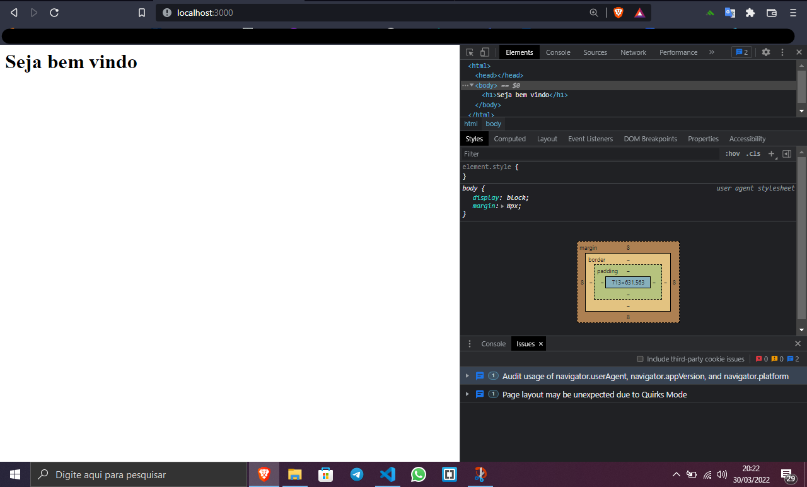
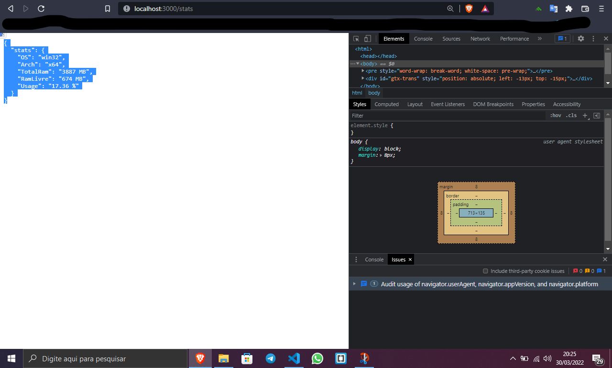

# Criando-um-server-Node.js

Como podem ver esse server localhost rodando na porta 3000, sua principal função é mostrar as informações:                             
|   OS     |
│   Arch   │
│ TotalRam │
│ RamLivre │
│  Usage   |                                          
Segue as fotos de demonstração:

